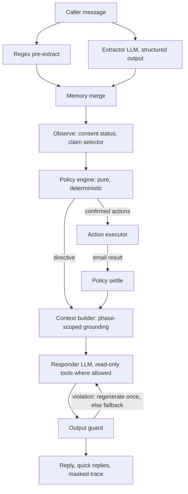

# Insurance claims SOP agent

## 1. Overview

A claims support agent that follows a fixed standard operating procedure
(**VERIFY_ID → RESOLVE_INTENT → PROCESS_CASE → POST_PROCESS**) while still holding a natural conversation.
The core idea: **code owns the workflow; the LLM owns the language.** Deterministic code decides phases, gates,
allowed actions and every side effect. The LLM only extracts structured meaning from the caller's message and writes
the reply from a directive and phase-scoped grounding. Before verification, no policyholder record data enters any
LLM request, so even a manipulated model has nothing to leak; an output guard is the second line of defense.

The full design is in [`docs/SPEC.md`](docs/SPEC.md); every deviation or clarification is recorded in
[`docs/DECISIONS.md`](docs/DECISIONS.md).

## 2. Quick start

You need an Anthropic API key. The extractor runs on `claude-haiku-4-5-20251001` and the responder and summary
writer on `claude-sonnet-5` (see `.env.example`).

### Docker (one command)

```bash
docker build -t insurance-sop-agent .
docker run --rm -p 8000:8000 -e ANTHROPIC_API_KEY=sk-ant-... insurance-sop-agent
# Open http://localhost:8000
```

Or with Compose, which reads `.env` and mounts `./var` so emails, SMS, traces and handoff tickets are visible:

```bash
cp .env.example .env          # then put your key on the ANTHROPIC_API_KEY line
docker compose up --build     # HOST_PORT=18000 docker compose up  to use another port
```

The image pins the demo date with `DEMO_TODAY=2026-03-10`; add `-e DEMO_TODAY=` to use the real date.

### Local development

```bash
uv sync
cp .env.example .env          # add your key
uv run uvicorn sop_agent.main:create_app --factory --reload --port 8000     # or: make dev
```

`make` targets (`install`, `dev`, `test`, `live`, `eval`, `check`, `docker-build`, `docker-run`) wrap the same
commands. Without `make` (common on Windows), run the `uv run ...` lines from the `Makefile` directly.

### Providing the API key

- **Server key:** set `ANTHROPIC_API_KEY` (environment, `.env`, or `-e` for Docker). It always wins.
- **Tester key:** if no server key is set and `ALLOW_CLIENT_API_KEY=true` (the default), the UI asks for a key. It is
  kept only in the page's memory and in the server's memory for that conversation, and is never stored, logged or
  returned.
- With neither, the UI shows setup instructions and the API answers 503.

## 3. Using the demo

The page has three columns (one panel at a time on narrow screens):

- **SOP route (left):** the four numbered phases. The lock on Verify ID opens when verification completes, and the
  current sub-stage (identity, authorization, consent) shows under it. Hints the caller gave early appear as
  "held for later" chips under Resolve: grey before verification, lit once they're used.
- **Conversation (centre):** messages, quick replies (they send exactly what they say), and banners for verified,
  waiting for approval, transferred and email sent.
- **Inspector (right):** *Memory* (identity checklist as provided/declined/missing only, verification and consent
  status, hints, deferred questions, selected claim), *Turn* (this turn's events, pending question, guard results,
  tool calls, directive, NLU, latency and tokens, full timeline) and *Outbox and tickets* (the email draft, sent
  emails, the handoff ticket). Everything is masked.

**Scenarios:** pick one in the header and press **Play scenario** (sends every turn) or **Step** (one at a time).
The scripts are the eval scenarios in `evals/scenarios/`.

**Demo date:** the header shows it. The sample appeal deadlines (March 18 and April 15, 2026) only make sense before
them, so the demo runs on March 10, 2026.

**Consent scenarios:** the *Consent* picker applies to new conversations. `default` goes pending → approved;
`timeout` stays pending until it times out. Use it with the representative scenarios.

## 4. Architecture



**Module dependencies.** `api → agent.orchestrator → nlu · sop · agent.context · agent.responder · agent.guard ·
tools · postprocess`, all resting on `domain · data`. `sop/`, `domain/` and `data/` never import `llm/`, `agent/` or
`api/`; `sop/` is pure and synchronous (time comes from an injected clock); `llm/` knows nothing about insurance.
Wiring happens only in `container.py`. The engine parts (state machine, directive, orchestrator, guard framework,
LLM layer, API, UI) hold no insurance knowledge, which lives in `domain/`, `data/`, `sop/handlers/`, the playbooks,
guidance and prompts.

**One turn, the brief's example.** *"I'm the policyholder. My name is Margaret Chen, policy POL-9921. I'm calling
about my denied healthcare claim from January. DOB is 1985-03-15, SSN last four is 4472."*

1. Regex finds the policy number, DOB and ID last four; the extractor adds the name, role, case hints (healthcare,
   denied, January) and the denial intent. Memory stores the hints (`HINT_STORED`).
2. VERIFY_ID: three fields match one policyholder → `VERIFIED` → RESOLVE_INTENT in the same turn.
3. RESOLVE_INTENT scores the caller's claims from the stored hints: CL-2048 = 6, CL-2011 = 0, the others −6, so
   CL-2048 is resolved automatically and the path is `denial_question` → PROCESS_CASE.
4. The context builder grounds CL-2048, its document guidance and the appeal deadline status computed by code
   (March 18, 8 days left). The responder confirms verification, names the claim, explains the denial and the
   deadline, and asks one question. The guard checks the reply.

Actual reply from the live model: *"Thanks, Margaret — you're verified. Let's go over claim CL-2048, the
healthcare claim opened January 12th, which was denied because the review file was missing your pathology report
and the treating provider's office note. … You've got until March 18th to file an appeal, which gives you 8 days
from today. Would you like me to walk you through how to submit those documents?"*

## 5. SOP design

| Phase | Freedom | Goal | Tools |
|---|---|---|---|
| VERIFY_ID | Strict | Verify identity; for representatives also authorization and real-time consent | None |
| RESOLVE_INTENT | Bounded | Pick the claim and the path from code-scored candidates | `list_claims` |
| PROCESS_CASE | Guided | Carry out the path, answer grounded follow-ups | All four read-only tools |
| POST_PROCESS | Strict | Offer the summary email and respect the choice | None |
| ESCALATED / ENDED | Terminal | Live-agent handoff / session over | None |

Transitions follow a whitelist (`sop/transitions.py`): nothing returns to VERIFY_ID, nothing skips it, terminal
phases never advance, and one message can pass up to three phases.

**Verification (anti-probing).** Identity passes only when exactly one record matches at least 3 of full name, DOB,
phone, email and SSN/national ID last four (aliases count; there's no fuzzy matching). The policy number only
narrows the candidates. An evaluation runs only with 3+ fields and new information, so a caller can't learn which
field was wrong; replies after a failure are generic; three failures lock verification and transfer to a live
agent. Invalid formats are named ("I couldn't read the date"), because a format problem says nothing about the
record. Declined fields aren't asked again, and if too few remain the agent explains and offers a transfer.

**Representatives and consent.** A caller for someone else gives the *policyholder's* details. After identity
passes, their name and relationship must match an authorization record (relationship synonyms such as son/child);
then, with the caller's agreement, the policyholder is texted an approval request, and the status is polled each
turn. Only an approval completes verification. A failed authorization, a decline or a timeout is final for the
session, and the agent offers a live representative.

## 6. Safety invariants

| ID | Invariant | Enforced in | Tested in |
|---|---|---|---|
| INV-1 | LLM output never changes phase or verification and never runs side effects | `sop/policy.py` (NLU is the only LLM input) | `test_policy.py`, `test_transitions.py`, `prompt_injection` eval |
| INV-2 | No record data in any LLM request before verification | `sop/phases.py` scopes, `agent/context.py` | `test_phases.py`, `test_context.py`, `test_extractor.py`, `test_end_to_end.py` request scans |
| INV-3 | No record data in replies before verification (G1) | `agent/guard.py` | `test_guard.py`, `test_end_to_end.py`, every eval turn (`no_record_leak`) |
| INV-4 | Tools see only the verified caller's data; `party_id` never comes from the LLM | `tools/registry.py`, `tools/read_tools.py` | `test_registry.py`, `test_responder.py` |
| INV-5 | The LLM has no write tools; actions run only after confirmation stored in state | `sop/policy.py`, `tools/executor.py` | `test_executor.py`, `test_consent_flow.py`, `test_post_process.py` |
| INV-6 | The email is sent only after an explicit yes to the latest offer | `sop/handlers/post_process.py`, `TurnContext.answer()` | `test_post_process.py`, `test_policy_plumbing.py` |
| INV-7 | Transitions follow the whitelist; never back to VERIFY_ID | `sop/transitions.py` | `test_transitions.py` |
| INV-8 | Every LLM failure has a deterministic fallback that leaks nothing | `agent/orchestrator.py`, `sop/templates.py` | `test_end_to_end.py` fault injection; every directive is checked in the policy tests |
| INV-9 | PII masked in logs, traces and debug views; API keys never logged or returned | `observability/masking.py`, `observability/logging.py`, `config.py`, `api/debug.py` | `test_masking.py`, `test_logging.py`, `test_api.py` |
| INV-10 | No hard-coded IDs or data text in business logic | Code review, grep checks, tests on an edge-case dataset | `test_static_ui.py`, `test_prompt_loader.py`, edge-case fixtures in `tests/fixtures/edge_cases/` |

Safety-critical rules were also mutation-tested: each was deliberately broken and the suite had to fail.

## 7. Memory across phases

Every turn writes everything it extracted into memory, whatever the phase ("write always, read by phase").
Identity values, case hints (type, status, date, keywords), intents, questions, representative details, documents
the caller can't get, and emotion are all merged by pure rules in `memory/merge.py`. What each phase may *read* is
controlled by its context scopes: before verification, only the SOP status (field names and statuses, no values),
the caller's own stated hints and general knowledge.

In the Margaret case, "denied healthcare claim from January" is stored during VERIFY_ID and used by RESOLVE_INTENT
in the same turn to resolve CL-2048 without asking again. A question the caller asks before verification ("why was
my claim denied?") is labelled `account` by the extractor, deferred, and answered as soon as PROCESS_CASE starts;
general questions ("what's an EOB?") are answered right away in any phase.

## 8. Grounding

- **Document guidance (K1–K7):** claim document names are matched to guidance keys deterministically
  ("pathology report" → "original pathology report"; "diagnosis report" has none and falls back to general
  guidance). Follow-up topics are selected by path and intent and triggered by the extractor or by phrases; their
  templates are rendered by code, and a topic with an unknown placeholder is skipped.
- **Code computes dates and amounts:** deadline state and days remaining, and amounts formatted from decimals. The
  LLM only restates them.
- **Output guard:** G1 (before verification, no record tokens the caller didn't say), G2 (no other policyholder's
  data), G3 (no echo of the caller's DOB, ID digits or full phone), G4 (amounts and dates must come from grounding,
  tool results or the caller), G5 (no "I've sent it" without the matching event). A violation regenerates once
  with a note naming only the rule; a second violation uses the directive's fallback.
- **Summary email:** facts are built by code from the case log; the writer may only rephrase them, and its draft is
  checked by the same guard against those facts, with a template fallback.

## 9. Scope control and emotional support

- **Scope:** off-topic messages and manipulation attempts are declined politely and count toward a streak; at 3 the
  agent offers a live representative, at 5 it transfers. Mixed messages get the in-scope part answered. Medical,
  legal, tax and investment questions are declined with a pointer to the right professional.
- **Emotion:** frustrated or angry callers get the specific cause acknowledged, one apology, the reason for the
  step (from `sop/reasons.py`), options and one question; anxious, confused and sad callers get their own
  strategies; abuse gets one calm boundary, then a transfer.
- **Persuasion budget:** resisting a verification gate is counted; after three attempts the agent stops explaining
  and offers a transfer, and resisting again transfers. The gate is never bypassed.
- **Escalation order:** safety concern, a request for a person, lockout, the off-topic limit, persuasion exhausted,
  repeated abuse, and exhausted document alternatives (offered, then transferred on a yes).

Example, before verification with only the name given: *"I already told you who I am. Just tell me why my claim
was denied."* → the agent acknowledges the frustration, explains that claim details are protected, notes the
question for after verification, and asks for two more details, without hinting at the claim.

## 10. Testing and evaluation

```bash
make check     # ruff lint + format check, mypy (strict), pytest without live tests
make live      # 3 live tests: extractor, one full turn, summary writer (needs a key)
make eval      # 18 real-model scenarios, writes evals/report.md
```

Offline: **665 tests** (unit and integration with `FakeLLMClient`), including an INV-2 scan of every LLM request
made before verification and fault injection for every LLM component.

Real-model scenario evals (`python -m evals.run`, each scenario run once; see D61):

| Scenario | Result | Scenario | Result |
|---|---|---|---|
| margaret_happy_path | pass | representative_consent_approved | pass |
| margaret_skip_email | pass | representative_consent_timeout | pass |
| frustrated_before_verification | pass | representative_not_authorized | pass |
| refuse_id_use_phone_email | pass | off_topic_retries | pass |
| partial_answers_and_clarifications | pass | prompt_injection | pass |
| failed_verification_lockout | pass | live_agent_request_midflow | pass |
| cross_record_mix | pass | ungrounded_question | pass |
| alias_name_yaven_li | pass | document_alternatives_exhausted | pass |
| national_id_ma_tian | pass | medical_advice | pass |

**18/18 passed**, 100 LLM calls, about 430k input tokens, roughly $0.73 per full run, 4–7 s per turn. The baseline
was 16/18; the fix (defining the `done` dialog act in the extractor prompt) is described in `evals/report.md`.
Every eval turn also checks that nothing leaks before verification. Across the final run's 49 turns there were no
fallback replies and no guard blocks.

## 11. Design decisions and trade-offs

The most important entries in `docs/DECISIONS.md`:

- **Two LLM calls per turn** (extraction and reply) in exchange for a controllable, testable workflow.
- **Question labels from the extractor** (`account`, `general`, `process`, `out_of_scope`) decide what's deferred
  until verification, so mixed questions are split correctly (D21).
- **The anti-probing signature includes the policy number**, normalized on both sides (D15).
- **Actions and the policy stay pure:** the email is sent by the executor after the policy plans it; a failed send
  stays in POST_PROCESS and offers a retry (D38).
- **Fictitious few-shot examples** in the extractor prompt, because the spec's examples used real records that would
  otherwise reach every pre-verification request (D39).
- **Keys:** a UI-entered key lives only in server memory for that session; the log formatter redacts anything
  shaped like a key, including tracebacks (D57, D64).

## 12. Limitations and future work

- **Latency:** two LLM calls per turn add a few seconds; streaming or merging the calls would help.
- **Knowledge-based verification** has limited security; production would add OTP or similar.
- **The guard is lexical:** a paraphrased leak is possible in theory, but before verification the model never has
  record data (INV-2).
- **No fuzzy matching beyond listed aliases:** some speech-recognition errors will fail verification, deliberately.
- **Consent is polled once per turn;** production would use push notifications.
- **Formal appeals can't be filed here;** those requests go to a live agent.
- **Sessions live in memory** on a single instance; there's no persistence or horizontal scaling.
- **English only;** the guidance data is already structured for other languages.
- **Untuned thresholds** (attempts, off-topic limits, persuasion budget).
- **Evals ran once per scenario:** they show correctness, not stability; `--repeat N` measures stability.
- **The SOP definition is code,** not declarative configuration; making it data would let the same engine run other
  procedures.
- **The UI loads Public Sans from Google Fonts** and falls back to the system font offline.

## Demo script (3–4 minutes)

1. **Margaret's full flow (about 2 minutes).** Play `margaret_happy_path`, or type the brief's sentence. Point out
   the hint chip under Resolve and the stored hints in the Inspector; the lock opens and CL-2048 is found in the same
   turn. Ask how to submit the documents and what to do without the original, say "that's all", show the draft in
   *Outbox and tickets*, agree to send it, and show the sent email.
2. **Emotion and SOP recovery (about 45 seconds).** Play `frustrated_before_verification`: empathy, a reason and
   options, with nothing leaked.
3. **Representative and consent (about 1 minute).** Play `representative_consent_approved` (pending, then
   approved, then the claim). Switch *Consent* to `timeout` and play `representative_consent_timeout`: the account is
   never discussed and a live representative is offered.
4. **Scope control and injection (about 30 seconds).** Play `off_topic_retries` (a live-agent offer after three),
   then `prompt_injection` (the SOP doesn't change).
